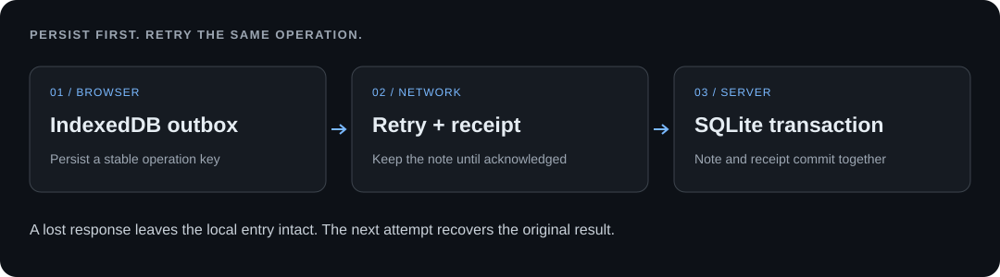

# Offline Sync Lab

**Keep a local write through disconnection. Recover a lost acknowledgement without duplicating the server effect.**

[Português](README.pt.md) · [Tests](https://github.com/OAtumFresco/offline-sync-lab/actions/workflows/test.yml) · [Rui Andrade](https://github.com/OAtumFresco)

A runnable browser outbox and HTTP server, implemented with IndexedDB, a service worker and SQLite. The interesting case happens when a write succeeds but its response never reaches the browser: the client cannot tell whether to retry. This lab makes that failure reproducible.



## Run locally

Requires **Node.js 22.13+** with `node:sqlite` available; use Node 22 or 24. SQLite may print an experimental warning on some versions. There are no npm dependencies or build steps.

```sh
git clone https://github.com/OAtumFresco/offline-sync-lab.git
cd offline-sync-lab
npm start
```

Open **http://127.0.0.1:4178**. Use the same hostname and port between visits; browser storage belongs to that origin. `LAB_PORT` can override the port.

```sh
npm run check
npm test
```

## Try the failure

1. Enable **Simulate offline**, enter a sample note and choose **Save locally**. It appears in the device queue, not on the server.
2. Reload the page. Its IndexedDB entry remains. After an initial online visit installs the service worker, the page can also reload with the server stopped.
3. Restore the connection and choose **Sync now**. The server saves the note; its matching receipt lets the browser remove the queue entry.
4. Enable **Lose the next acknowledgement** and save a different note. The server commits and closes the socket before replying. The browser retries the same operation key and recovers the existing result.

The offline checkbox simulates delivery being unavailable. Stopping the server tests an actual unavailable endpoint. Neither deletes local data.

## What is guaranteed — and under which conditions

| Case | Behavior |
| --- | --- |
| Page closes before transmission | An IndexedDB transaction completes before the UI reports local success. The entry remains if browser storage is retained. |
| Same key and payload arrive repeatedly | One note and one stored receipt in the same SQLite transaction; retries return the original note ID. |
| Same key arrives with a different payload | HTTP 409. The browser keeps a blocked entry for inspection. |
| Server commits but the response is lost | The queue entry remains. A retry uses its original key. |
| Receipt insertion fails | The transaction rolls back the note as well. |
| Server restarts | Notes and receipts remain in `.data/notes.sqlite`. |
| Multiple sync requests | One active sync per tab; Web Locks serialize delivery across tabs when available. Server deduplication remains the final safeguard. |

Transport can deliver a request repeatedly. The guarantee is **one stored effect per operation key while its receipt is retained**, not exactly-once network delivery. A second deliberate save receives a new key even if its text is identical.

## Read the implementation

- [`public/outbox.js`](public/outbox.js): IndexedDB transactions, including completion before acknowledging a local save.
- [`public/sync.js`](public/sync.js): acknowledgement validation, retry backoff, permanent rejection and concurrent-call coalescing.
- [`src/store.js`](src/store.js): transactional note creation and persistent idempotency receipts.
- [`src/server.js`](src/server.js): bounded JSON input, loopback-only entry point and explicit response-loss injection.
- [`public/sw.js`](public/sw.js): offline shell cache. API responses are never cached.

The tests include real socket loss after commit, concurrent HTTP retries, rollback injection, database reopen, malformed acknowledgements and local queue failures. See [verification](docs/verification.md) for the manual browser protocol.

## Deliberate limits

This is an append-only, single-user teaching implementation. It does not solve shared editing, conflict merges, attachments, account isolation, encryption or background delivery with the page closed. `navigator.onLine` is only a hint; actual failures keep the note queued. Retries continue while the page is open, with capped exponential backoff and jitter.

Browser storage may be cleared, denied or evicted. Server receipts are retained indefinitely here: a real service needs a documented retention period and a compatible client retry policy. Queue size, database growth and synchronous SQLite throughput are not production-budgeted. Local fault injection is enabled only by the demo entry point and defaults off when constructing the server.

The server binds to loopback and rejects other origins; it has no authentication and is not prepared for public hosting. Use fictitious text. Stop it before deleting `.data/` to reset the server; that also removes the deduplication history.

## References and availability

Independent implementation of public patterns: [IndexedDB](https://developer.mozilla.org/en-US/docs/Web/API/IndexedDB_API), [Node SQLite](https://nodejs.org/api/sqlite.html) and [idempotent requests](https://docs.stripe.com/api/idempotent_requests). It contains no application code or data from the products in my portfolio.

No open-source license has been assigned. See [NOTICE](NOTICE). [Contact Rui Andrade](https://ratecnologias.cv/#contacto).
