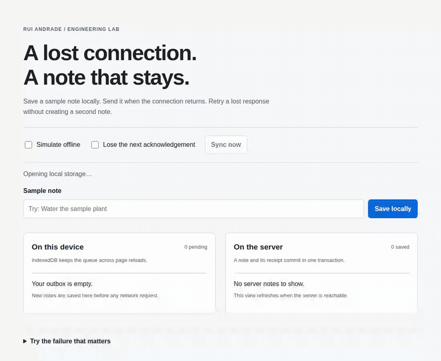

# Offline Sync Lab

[](https://github.com/OAtumFresco/offline-sync-lab/actions/workflows/test.yml)  [](https://github.com/OAtumFresco/offline-sync-lab/releases/tag/v0.1.0)

**Guardar uma operação sem ligação e recuperar uma confirmação perdida sem duplicar a escrita no servidor.**

[English](README.md) · [Testes](https://github.com/OAtumFresco/offline-sync-lab/actions/workflows/test.yml) · [Rui Andrade](https://github.com/OAtumFresco)

Uma fila de envio no navegador, acompanhada por um servidor HTTP executável. O caso central é uma escrita que chega à base de dados, mas cuja resposta se perde: o navegador precisa de repetir o pedido sem criar outra nota.

## Ver em ação



Gravação automática da interface, com verificações antes de cada resultado. [Vídeo MP4](https://github.com/OAtumFresco/offline-sync-lab/releases/download/v0.1.0/demo.mp4) · [Como reproduzir](docs/verification.md).


## Executar

Requer **Node.js 22.13+**, com `node:sqlite` disponível. Usar Node 22 ou 24. Algumas versões apresentam um aviso experimental do SQLite. A execução da aplicação não requer dependências npm nem compilação; os testes de navegador usam Playwright como dependência de desenvolvimento.

```sh
git clone https://github.com/OAtumFresco/offline-sync-lab.git
cd offline-sync-lab
npm start
```

Abrir **http://127.0.0.1:4178**. Manter o mesmo endereço e porta para conservar a mesma origem de armazenamento. A variável `LAB_PORT` permite escolher outra porta.

```sh
npm run check
npm test
```

Para testar no navegador:

```sh
npm ci
npx playwright install chromium firefox webkit
npm run test:browser
```

Em Linux, usar `npx playwright install --with-deps chromium firefox webkit` para instalar também as bibliotecas do sistema.

## Experiência

1. Ativar **Simulate offline**, escrever uma nota fictícia e carregar em **Save locally**. A nota fica no dispositivo.
2. Recarregar a página: a entrada persiste em IndexedDB. Depois de uma primeira visita instalar o service worker, também é possível recarregar com o servidor desligado.
3. Restabelecer a ligação e carregar em **Sync now**. A nota passa para o servidor e sai da fila após a confirmação.
4. Ativar **Lose the next acknowledgement** e guardar outra nota. O servidor confirma a transação na base de dados, mas fecha a ligação antes de responder. A repetição recupera o resultado já existente.

## Decisões e garantias

| Situação | Resultado |
| --- | --- |
| Fechar a página antes de enviar | A transação local termina antes de mostrar sucesso; a entrada mantém-se enquanto o navegador conservar o armazenamento. |
| Repetir a mesma chave e conteúdo | A transação SQLite mantém uma só nota e o respetivo recibo. |
| Reutilizar a chave com outro conteúdo | HTTP 409; a entrada fica bloqueada e visível. |
| Perder a resposta após a escrita | A fila mantém a chave original e tenta novamente. |
| Falhar a gravação do recibo | A nota também é revertida. |
| Reiniciar o servidor | Notas e recibos persistem em `.data/notes.sqlite`. |
| Sincronizar em vários separadores | Web Locks coordenam os envios quando disponíveis; a deduplicação do servidor é a garantia final. |

A rede pode entregar o pedido várias vezes. A garantia é **um efeito guardado por chave enquanto o recibo existir**. Guardar deliberadamente outra nota gera outra chave, mesmo com texto igual.

O [motor de sincronização](public/sync.js) valida as confirmações e distingue erros temporários de rejeições permanentes. O [armazenamento](src/store.js) grava nota e recibo numa única transação. O [service worker](public/sw.js) guarda a interface; nunca guarda respostas da API.

## Limites

Exemplo educativo para acrescentar notas de um utilizador. Não inclui edição colaborativa, resolução de conflitos, anexos, autenticação, isolamento de contas ou envio em segundo plano com a página fechada. A indicação `navigator.onLine` não bloqueia uma tentativa de envio; falhas reais conservam a fila.

O navegador pode apagar ou recusar armazenamento. Os recibos SQLite ficam guardados indefinidamente neste exemplo; em produção seria necessário definir retenção, limites de crescimento e uma política de repetição compatível. Não foram validados volumes de produção. O servidor usa apenas loopback e não está preparado para alojamento público. Usar dados fictícios.

Os testes incluem perda real da ligação após a escrita, repetições HTTP concorrentes, reversão da transação, reabertura da base de dados e confirmações inválidas. O [protocolo de verificação](docs/verification.md) distingue os testes automáticos das experiências manuais no navegador.

Implementação independente de padrões públicos: [IndexedDB](https://developer.mozilla.org/en-US/docs/Web/API/IndexedDB_API), [SQLite no Node](https://nodejs.org/api/sqlite.html) e [pedidos idempotentes](https://docs.stripe.com/api/idempotent_requests). Não contém código ou dados das aplicações do meu portefólio.

Ainda não foi atribuída uma licença open source. Consultar [NOTICE](NOTICE). [Contactar Rui Andrade](https://ratecnologias.cv/#contacto).
